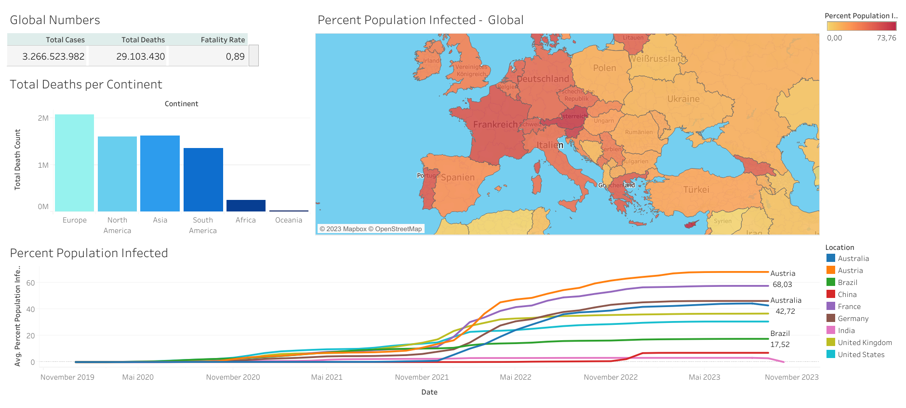

# SQL Project Portfolio

## Project Overview

This project is designed to showcase my SQL skills by leveraging a well-documented dataset with abundant data points, minimizing the need for initial data cleaning. It is designed to be lightweight and is expected to run smoothly on most modern systems.  
The primary objectives are to:

1. MySQL Server Setup: Demonstrate the ability to set up a MySQL server and configure a database for efficient data storage and retrieval.

2. Data Import: Showcase the process of importing data from a CSV file into MySQL tables, including essential data transformation steps.

3. SQL Query Proficiency: Exhibit proficiency in writing diverse SQL queries for data analysis, allowing for meaningful insights to be extracted from the dataset.

The project utilizes a comprehensive dataset from [ourworldindata.org](https://ourworldindata.org/covid-deaths), focusing on COVID-19-related statistics. The dataset contains 67 data categories, offering ample opportunities to explore various SQL capabilities. The aim is to provide a comprehensive example of working with real-world data and showcasing SQL expertise, from data preparation to insightful analysis.  

Using a subset of SQL queries listed in [tableau_views](tableau-views.sql) I created a tableau dashboard:  

  

An interactive version can be accessed via [public.tableau.com/](https://public.tableau.com/app/profile/yannik.karsten/viz/CovidDashboard_16972811581590/Dashboard1#1)

## How to Use

### 1. MySQL Setup:
1. Download MySQL Community Server for your preferred operating system (e.g., Windows, macOS, or Linux) from [mysql.com](https://dev.mysql.com/downloads/mysql/).  
2. Install both MySQL Server and MySQL Shell.
3. Set up a local MySQL server (you can keep the default network options) and establish a password for the root admin account.
4. After installation, open the MySQL command-line client and log in.

### 2. Database Creation:
1. Create a MySQL database to hold the data: `CREATE DATABASE covid;`
2. Continue using the command-line client or choose an alternative SQL editor. Personally, I use [popSQL](https://popsql.com/) because it not only stores a history of your queries but also allows you to explore the data using interactive visuals. This can be particularly helpful for visualizing and analyzing your SQL data effectively. 

### 3. Data Import:
Now, let's proceed to importing the dataset into the MySQL database.

## SQL Queries

### 1. Connect to database

I set up a local mySQL server and used popSQL to write queries. 

```sql
-- connect to database
USE
    covid;
```

By default mySQL only has reading privileges to specific directories.
```
-- List directory allowed for import
SHOW VARIABLES
    LIKE 'secure_file_priv';

```

### 2. Load data from CSV

I created two subsets of the original csv file that are specific to covid_deaths and covid_vaccinations. For the sake of brevity, I only show the table "covid_deaths" here.

```
-- Create the table
CREATE TABLE
    covid_deaths (
        iso_code VARCHAR(255),
        continent VARCHAR(255),
        location VARCHAR(255),
        `date` DATE,
        total_cases BIGINT,
        new_cases INT,
        new_cases_smoothed FLOAT,
        total_deaths INT,
        new_deaths INT,
        new_deaths_smoothed FLOAT,
        total_cases_per_million DECIMAL(18, 6),
        new_cases_per_million DECIMAL(18, 6),
        new_cases_smoothed_per_million DECIMAL(18, 6),
        total_deaths_per_million DECIMAL(18, 6),
        new_deaths_per_million DECIMAL(18, 6),
        new_deaths_smoothed_per_million DECIMAL(18, 6),
        reproduction_rate DECIMAL(5, 2),
        population BIGINT
    );
```
Next, I used the `LOAD DATA` statement to read data from the specified CSV file and insert it into the designated MySQL table.
```
-- Load data from CSV
LOAD DATA
    INFILE 'C:\\ProgramData\\MySQL\\MySQL Server 8.1\\Uploads\\covid_deaths.csv' INTO
TABLE
    covid_deaths FIELDS TERMINATED BY ',' ENCLOSED BY '"' LINES TERMINATED BY '\n' IGNORE 1 ROWS -- Skip the header row
    (
        iso_code,
        continent,
        location,
        @date_column,
        @total_cases,
        @new_cases,
        @new_cases_smoothed,
        @total_deaths,
        @new_deaths,
        @new_deaths_smoothed,
        @total_cases_per_million,
        @new_cases_per_million,
        @new_cases_smoothed_per_million,
        @total_deaths_per_million,
        @new_deaths_per_million,
        @new_deaths_smoothed_per_million,
        @reproduction_rate,
        @population
    )
SET
    `date` = STR_TO_DATE(@date_column, '%Y-%m-%d'),
    total_cases = NULLIF(@total_cases, ''),
    new_cases = NULLIF(@new_cases, ''),
    new_cases_smoothed = NULLIF(@new_cases_smoothed, ''),
    total_deaths = NULLIF(@total_deaths, ''),
    new_deaths = NULLIF(@new_deaths, ''),
    new_deaths_smoothed = NULLIF(@new_deaths_smoothed, ''),
    total_cases_per_million = NULLIF(@total_cases_per_million, ''),
    new_cases_per_million = NULLIF(@new_cases_per_million, ''),
    new_cases_smoothed_per_million = NULLIF(@new_cases_smoothed_per_million, ''),
    total_deaths_per_million = NULLIF(@total_deaths_per_million, ''),
    new_deaths_per_million = NULLIF(@new_deaths_per_million, ''),
    new_deaths_smoothed_per_million = NULLIF(@new_deaths_smoothed_per_million, ''),
    reproduction_rate = CASE
        WHEN TRIM(@reproduction_rate) REGEXP '^[0-9]*\\.?[0-9]+$' THEN TRIM(@reproduction_rate)
        ELSE NULL
    END,
    -- " " was treated as an incorrect decimal value. Thus, I set reproduction_rate to NULL when it encounters non-numeric values.
    population = NULLIF(@population, '');
```

Explanation
- Fields Terminated By: Specifies the character that separates fields in the CSV file.
- Enclosed By: Specifies the character that encloses fields containing special characters or spaces.
- Lines Terminated By: Specifies the character that indicates the end of a line.
- IGNORE 1 ROWS: Skips the header row in the CSV file.
- SET: Maps each column from the CSV file to the corresponding column in the table, applying transformations as necessary.
  - As the csv file has some empty cells, it was necessary to set "" to NULL
  
### 3. Query Categories

#### Select, FROM, WHERE, ORDER BY

```
-- Whats the fatatlity rate in germany?
SELECT
    location,
    date,
    total_cases,
    total_deaths,
    (total_deaths / total_cases) * 100 as FatalityRate
FROM
    covid_deaths
WHERE
    location LIKE 'germany'
ORDER BY
    1,
    2;
```
```
-- Show what percentage of the population got covid
SELECT
    location,
    date,
    population,
    total_cases,
    (total_cases / population) * 100 as ContractionRate
FROM
    covid_deaths
WHERE
    location LIKE 'germany'
ORDER BY
    1,
    2;
```

#### Aggregate functions

```
--Show highest death count per population by continent
SELECT
    COALESCE(NULLIF(TRIM(continent), ''), 'Global') as continent,
    MAX(total_deaths) as TotalDeathCount
FROM
    covid_deaths
GROUP BY
    continent
ORDER BY
    TotalDeathCount DESC;
```
```
-- Show global data by day for
-- new cases
-- new deaths
-- Fatatlity rate 
SELECT
    date,
    SUM(new_cases) as total_cases,
    SUM(new_deaths) as total_deaths,
    SUM(new_deaths) / SUM(new_cases) * 100 as FatalityRate
FROM
    covid_deaths
GROUP BY
    DATE
ORDER BY
    1,
    2;
```

#### JOIN + common table expression
```
-- Show total Population vs Vaccinations
-- Using common table expression
WITH
    PopVsVac AS (
        SELECT
            dea.continent,
            dea.location,
            dea.date,
            dea.population,
            vac.new_vaccinations,
            SUM(vac.new_vaccinations) OVER (PARTITION BY dea.location, dea.date) as CumulativePeopleVaccinated,
            (
                SUM(vac.new_vaccinations) OVER (PARTITION BY dea.location, dea.date) / dea.population
            ) * 100 as PercentageVaccinated
        FROM
            covid_deaths dea
            JOIN covid_vaccinations vac ON dea.location = vac.location
            AND dea.date = vac.date
        WHERE
            dea.continent IS NOT NULL
        ORDER BY
            2,
            3
    )
SELECT
    *
FROM
    PopVsVac;
```

#### JOIN + Temporary Table
```
-- Using temp table
-- Drop table if it exists
DROP TEMPORARY
TABLE
    IF EXISTS PercentPopulationVaccinated;

-- Create the temporary table
CREATE TEMPORARY
TABLE
    PercentPopulationVaccinated (
        Continent VARCHAR(255),
        Location VARCHAR(255),
        `date` DATE,
        Population BIGINT,
        New_vaccinations BIGINT,
        CumulativePeopleVaccinated BIGINT
    );

-- Insert into the temporary table
INSERT INTO
    PercentPopulationVaccinated
SELECT
    dea.continent,
    dea.location,
    dea.date,
    dea.population,
    vac.new_vaccinations,
    SUM(CAST(vac.new_vaccinations AS SIGNED)) OVER (
        PARTITION BY dea.Location
        ORDER BY
            dea.location,
            dea.Date
    ) as CumulativePeopleVaccinated
FROM
    covid_deaths dea
    JOIN covid_vaccinations vac ON dea.location = vac.location
    AND dea.date = vac.date
WHERE
    dea.continent IS NOT NULL
ORDER BY
    2,
    3;

-- Select from the temporary table with the percentage calculation
SELECT
    *,
    (CumulativePeopleVaccinated / Population) * 100 as PercentageVaccinated
FROM
    PercentPopulationVaccinated;
```

#### Views
```
-- Creating View to store data for later visualization
CREATE VIEW
    PercentPopulationVaccinated as
SELECT
    dea.continent,
    dea.location,
    dea.date,
    dea.population,
    vac.new_vaccinations,
    SUM(CAST(vac.new_vaccinations AS SIGNED)) OVER (
        PARTITION BY dea.Location
        ORDER BY
            dea.location,
            dea.Date
    ) as CumulativePeopleVaccinated
FROM
    covid_deaths dea
    JOIN covid_vaccinations vac ON dea.location = vac.location
    AND dea.date = vac.date
WHERE
    dea.continent IS NOT NULL
ORDER BY
    2,
    3;

SELECT
    *
FROM
    PercentPopulationVaccinated
```

## Dependencies
- [MySQL Community Server](https://dev.mysql.com/downloads/mysql/): [8.1 or above]
  - Description: The project relies on a MySQL database for data storage and retrieval.

## License
This project is licensed under the MIT License - see the [LICENSE](license.txt) file for details.
